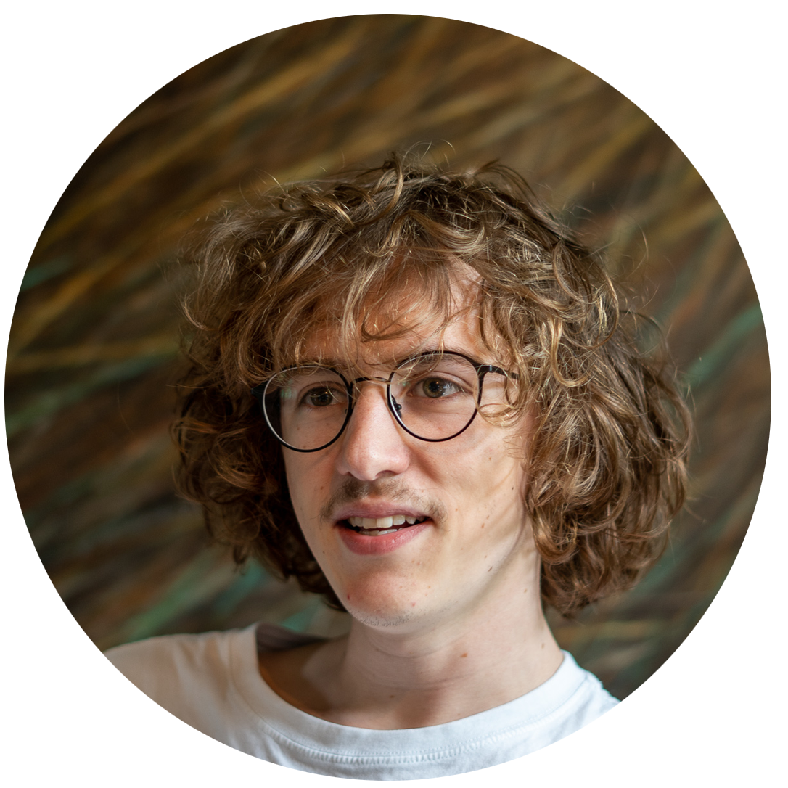

About
====================

Welcome to the n'th draft of Anshunino's personal website.
I am still a work in progress, so please be patient.

I am a trainee at the EMBL-EBI in Cambridge, UK. I am working on modelling active contours using spline interpolation as a Reinforcement Learning problem with Johannes Hugger under Dr Virginie Uhlmann's supervision at the Uhlmann Group. I graduated in 2022 from National Institute of Technology, Surathkal (India) in Electrical and Electronics Engineering.

I also sometimes convey art via the lossy subspace formed by words that may end up in the [**creative projects** section](/crea/).

<!-- To be notified on future posts you can use this good old [RSS feed](/feed.xml). -->
